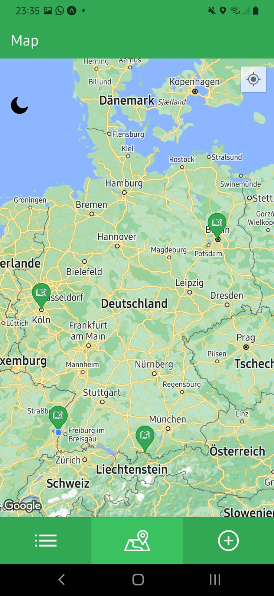

# MemoryMapper

## Beschreibung

Eine mobile Reise-App für Android und iOS, entwickelt mit React Native (Expo). Nutzer:innen sehen eine interaktive Weltkarte und können Orte als Erinnerungen markieren, mit Titel, Beschreibung, Bewertung (0 bis 10), Rezension und Foto aus der Galerie oder Kamera. Die Daten werden lokal in einer SQLite-Datenbank gespeichert. Neben der Karte gibt es eine Listenansicht zum Bearbeiten und Löschen, einen Wechsel zwischen Karte und Liste per Klick, die Anzeige des eigenen Standorts samt Kompass, verschiebbare Marker, die den gespeicherten Ort aktualisieren, und einen Light-/Dark-Mode.

 

## Features

**Karte**
- Erinnerungen als Marker, per Tippen mit allen Details im Modal
- Marker verschiebbar, der neue Standort wird automatisch gespeichert
- Eigener Standort, Kompass und Light-/Dark-Mode

**Liste**
- Alle Erinnerungen mit Titel und Bewertung
- Bearbeiten und Löschen
- Per Klick animiert zwischen Liste und Karte wechseln

**Hinzufügen und Bearbeiten**
- Titel, Beschreibung, Bewertung (0 bis 10), Rezension und Koordinaten
- Foto aus der Galerie oder direkt mit der Kamera
- Eigenen Standort per Knopfdruck als Koordinaten übernehmen

## Tech-Stack

- React Native mit Expo
- React Navigation
- react-native-maps
- SQLite (expo-sqlite)
- expo-location, expo-image-picker

## Installation

```bash
npm install
npx expo start
```

Scanne anschließend den QR-Code mit der Expo-Go-App.
